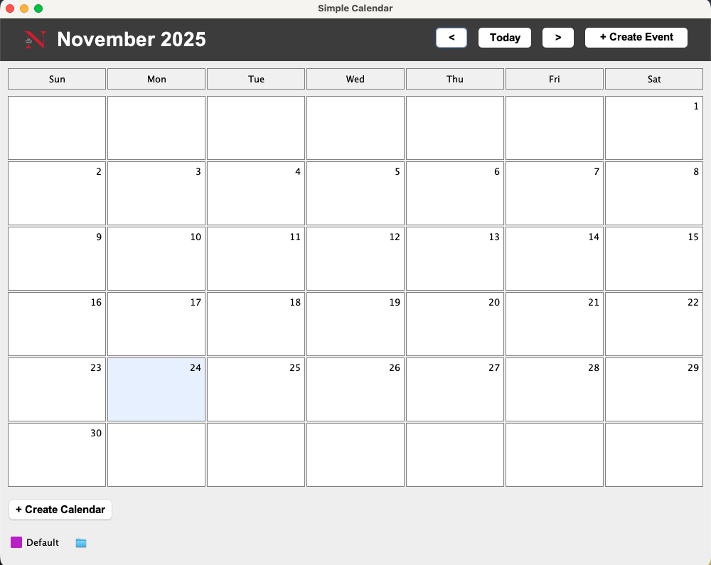

# Calendar Application - User Guide

## Project Structure
```
Calendar-Management-System/
├── build/
│   └── libs/
│       └── calendar-1.0.jar      (created after building)
├── public/
│   ├── commands.txt              (example valid commands)
│   ├── invalid.txt               (example invalid commands)
│   ├── GUI Image.png             (GUI screenshot)
│   └── class_diagram.png         (UML class diagram)
├── src/
│   ├── main/java/
|   └── test/java/
└── build.gradle
```

## Building the Application

**IMPORTANT:** All commands must be run from the project root directory.

### Build the JAR File
```bash
./gradlew jar
```

This creates the JAR at: `build/libs/calendar-1.0.jar`

## Running the Application

The application supports three modes: GUI, Interactive, and Headless.

### GUI Mode (Graphical Interface)
```bash
java -jar build/libs/calendar-1.0.jar --mode gui
```

This opens a graphical calendar interface. 

## Using the GUI

### Creating a Calendar
1. Click the **"+ Create Calendar"** button at the bottom left
2. Enter a calendar name (e.g., "Work", "Personal")
3. Select a timezone from the dropdown
4. Click **Save**
5. The new calendar appears in the calendar list with a random color

### Selecting Calendars to Display
- Each calendar has a checkbox in the bottom panel
- Check/uncheck calendars to show/hide their events
- Multiple calendars can be selected simultaneously
- Each calendar's events display in its assigned color

### Editing a Calendar
1. Click the **edit icon** next to a calendar name in the bottom panel
2. Modify the calendar name or timezone
3. Click **Save**

### Navigating Months
- Click **"<"** to go to the previous month
- Click **">"** to go to the next month
- Click **"Today"** to jump back to the current month

### Creating an Event
1. Click **"+ Create Event"** button in the top right
2. Select which calendar to add the event to
3. Enter event details:
    - Subject (required)
    - Start date and time
    - End date and time
    - Location (optional)
    - Description (optional)
    - Status: Public or Private (optional)
4. Check **"All-day event"** for events without specific times
5. Check **"Repeat"** and select options for recurring events:
    - Choose weekdays (M, T, W, R, F, S, U)
    - Choose end condition: "For X times" or "Until date"
6. Click **Save**

### Viewing Events on a Specific Day
1. Click on any day cell in the calendar grid
2. A dialog opens showing all events scheduled for that day
3. Events from all selected calendars are shown
4. Each event displays:
    - Subject and time range
    - Location (if set)
    - Description (if set)
    - Status (if set)

### Editing an Event
1. Click on a day cell to open the day events dialog
2. Click the **"Edit"** button next to the event you want to modify
3. Update event details in the form
4. Click **Save**
5. For recurring events, choose to edit:
    - This event only
    - This and following events
    - All events in the series

### Multi-Day Events
- Events spanning multiple days appear in all affected day cells
- Click any day the event spans to view/edit it
- Event widgets show with their calendar's color

### Deleting Events
- Currently not implemented in GUI mode
- Use interactive or headless mode for deletion

---

### Interactive Mode
```bash
java -jar build/libs/calendar-1.0.jar --mode interactive
```

**Example session:**
```
Calendar Application - Interactive Mode
Type 'exit' to quit
Enter command: 
create calendar --name Work --timezone America/New_York
Success: Calendar Work created
Enter command: 
exit
Exiting...
```

### Headless Mode
```bash
java -jar build/libs/calendar-1.0.jar --mode headless res/commands.txt
```
```bash
java -jar build/libs/calendar-1.0.jar --mode headless res/invalid.txt
```

**Output:**
```
Calendar Application - Headless Mode
Reading commands from: res/commands.txt
...
```

## Supported Commands (Interactive and Headless Modes)

### Managing Calendars

**Create calendar:**
```
create calendar --name Work --timezone America/New_York
```

**Edit calendar:**
```
edit calendar --name Work --property name WorkCalendar
edit calendar --name Work --property timezone America/Chicago
```

**Switch calendar:**
```
use calendar --name Work
```

### Copying Events

**Copy single event:**
```
copy event Meeting on 2025-10-24T10:00 --target Personal to 2025-10-25T14:00
copy event "Team Meeting" on 2025-10-24T10:00 --target Personal to 2025-10-25T14:00
```

**Copy events on date:**
```
copy events on 2025-10-24 --target Personal to 2025-10-25
```

**Copy events in range:**
```
copy events between 2025-10-24 and 2025-10-30 --target Personal to 2025-11-01
```

### Creating Events

**Single event:**
```
create event Meeting from 2025-10-24T10:00 to 2025-10-24T11:00
create event "Team Meeting" from 2025-10-24T10:00 to 2025-10-24T11:00
```

**All-day event:**
```
create event Birthday on 2025-10-25
create event "Birthday Party" on 2025-10-25
```

**Recurring event:**
```
create event Standup from 2025-10-27T09:00 to 2025-10-27T09:30 repeats MWF for 5 times
create event Gym from 2025-10-28T18:00 to 2025-10-28T19:00 repeats TR until 2025-11-15
```

### Editing Events

**Edit single event:**
```
edit event Subject Meeting from 2025-10-24T10:00 to 2025-10-24T11:00 with ImportantMeeting
edit event Subject "Team Meeting" from 2025-10-24T10:00 to 2025-10-24T11:00 with ImportantMeeting
```

**Edit from date:**
```
edit events Location Standup from 2025-10-27T09:00 with RoomA
```

**Edit series:**
```
edit series Description Gym from 2025-10-28T18:00 with Cardio
```

### Viewing Events

**Print on date:**
```
print events on 2025-10-24
```

**Print in range:**
```
print events from 2025-10-24T08:00 to 2025-10-26T20:00
```

### Status

**Check availability:**
```
show status on 2025-10-24T10:30
```

### Exporting

**Export to CSV:**
```
export cal calendar.csv
```

**Export to iCal:**
```
export cal calendar.ics
```

### Exit
```
exit
```

## Formats

- **Date:** `YYYY-MM-DD` (e.g., `2025-10-24`)
- **Time:** `HH:MM` (e.g., `10:00`)
- **DateTime:** `YYYY-MM-DDTHH:MM` (e.g., `2025-10-24T10:00`)
- **Timezone:** `Area/Location` (e.g., `America/New_York`, `Asia/Tokyo`)
- **Weekdays:** M=Monday, T=Tuesday, W=Wednesday, R=Thursday, F=Friday, S=Saturday, U=Sunday
- **Event Subject:**
    - Single word: `Meeting`, `Birthday`, `Gym`
    - Multiple words (in quotes): `"Team Meeting"`, `"Birthday Party"`

## Key Notes

- **GUI mode** provides a visual interface for creating, viewing, and editing calendars and events
- Single-word subjects don't need quotes in text commands
- Multi-word subjects must be in quotes in text commands
- Commands are case-insensitive (Interactive/Headless modes)
- Extra words are allowed between keywords
- Times convert automatically between timezones when copying
- Headless files must end with `exit`
- Events spanning multiple days appear in all affected day cells

For detailed code documentation, see source code in `src/main/java/`.
